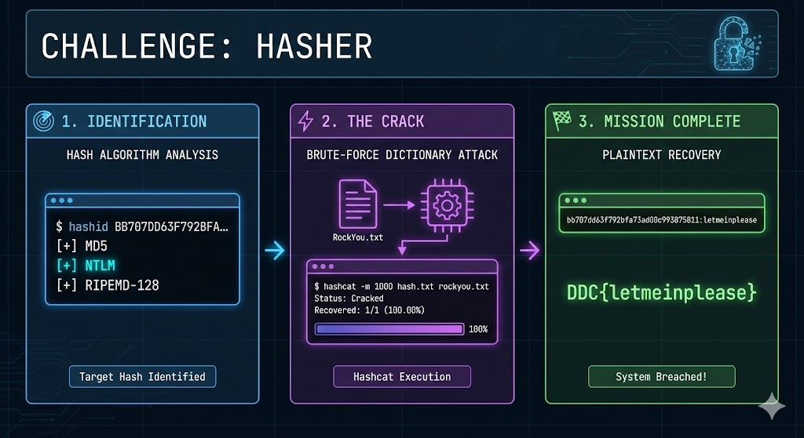

# Hasher: Trust the Hash (They Said)



> Image generated by Google Nano Banana Pro.

## Challenge

Welcome back.

For the nth time, someone was convinced that:

> “This time, the hasher is completely unbreakable.”

Turns out… not quite.

A new system.
A new hasher.
The same old overconfidence.

All that remains is this string:

`BB707DD63F792BFA73AD00C993875811`

Your task is to figure out what the hash is hiding.

Once you have the answer, submit it in the following format:

> DDC{your_answer_here}

Good luck; the IT department is counting on you (again).

## Solution

````shell
┌──(kali㉿kali)-[~]
└─$ hashid BB707DD63F792BFA73AD00C993875811           
Analyzing 'BB707DD63F792BFA73AD00C993875811'
[+] MD2
[+] MD5
[+] MD4
[+] Double MD5
[+] LM
[+] RIPEMD-128
[+] Haval-128
[+] Tiger-128
[+] Skein-256(128)
[+] Skein-512(128)
[+] Lotus Notes/Domino 5
[+] Skype
[+] Snefru-128
[+] NTLM
[+] Domain Cached Credentials
[+] Domain Cached Credentials 2
[+] DNSSEC(NSEC3)
[+] RAdmin v2.x
````

Multiple possible hash types are detected, but the most common ones are MD5 and NTLM.

**For MD5**:

``hashcat -m 0 -a 0 hash.txt /usr/share/wordlists/rockyou.txt``

**For NTLM**:

``hashcat -m 1000 -a 0 hash.txt /usr/share/wordlists/rockyou.txt``

NMTL (Windows) hashcat output:

``bb707dd63f792bfa73ad00c993875811:letmeinplease``

````shell
Dictionary cache hit:
* Filename..: /usr/share/wordlists/rockyou.txt
* Passwords.: 14344385
* Bytes.....: 139921507
* Keyspace..: 14344385

bb707dd63f792bfa73ad00c993875811:letmeinplease     
                            
Session..........: hashcat
Status...........: Cracked
Hash.Mode........: 1000 (NTLM)
Hash.Target......: bb707dd63f792bfa73ad00c993875811
Time.Started.....: Sun Feb 22 02:15:04 2026 (0 secs)
Time.Estimated...: Sun Feb 22 02:15:04 2026 (0 secs)
Kernel.Feature...: Pure Kernel (password length 0-256 bytes)
Guess.Base.......: File (/usr/share/wordlists/rockyou.txt)
Guess.Queue......: 1/1 (100.00%)
Speed.#01........: 1126.4 kH/s (0.59ms) @ Accel:1024 Loops:1 Thr:1 Vec:8
Recovered........: 1/1 (100.00%) Digests (total), 1/1 (100.00%) Digests (new)
Progress.........: 139264/14344385 (0.97%)
Rejected.........: 0/139264 (0.00%)
Restore.Point....: 131072/14344385 (0.91%)
Restore.Sub.#01..: Salt:0 Amplifier:0-1 Iteration:0-1
Candidate.Engine.: Device Generator
Candidates.#01...: koryna -> katong
Hardware.Mon.#01.: Util: 6%

Started: Sun Feb 22 02:14:54 2026
Stopped: Sun Feb 22 02:15:05 2026
````

FLAG: `DDC{letmeinplease}`
