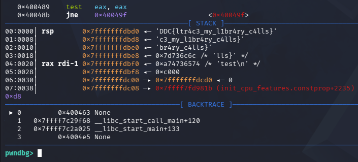

# Call Me Maybe

## Challenge

You just started your internship at NoTech, a cutting-edge cybersecurity startup.
On your very first day, your manager drops by your desk and slides a USB drive across the table.

"The security analyst before you left this behind.
It's some kind of locked terminal; nobody here knows the passphrase.
We've tried everything. Think you can crack it, rookie?"

She winks and walks away. You plug in the USB and find a single file: `call_me_maybe`.
You run it. It asks for a passphrase. You don't have it.
But something about the name bugs you... Call Me Maybe... calls... maybe?

What if the secret isn't inside the program, but in what the program calls?

File:

[Download](https://nextcloud.haaukins.com/s/zCGcc2eo55yZ4kM/download)
sha256: 2d244963b366620c5da1052e496f2e0d2d1d9b78d62a4333cf8ba6b22faff04c


## Solution

````shell
                                                                                                                                                                             
┌──(kali㉿kali)-[~/Downloads]
└─$ ltrace ./call_me_maybe
setvbuf(0x7f25298165c0, nil, 2, 0)                                                                         = 0
putchar(10, 0, 125, 0
)                                                                                     = 10
puts("  \342\225\224\342\225\220\342\225\220\342\225\220\342\225\220\342\225\220\342\225\220\342\225\220\342\225\220\342\225\220"...  ╔══════════════════════════════════════════╗
) = 135
puts("  \342\225\221      NoTech Security Termi"...  ║      NoTech Security Terminal v2.4       ║
)                                                       = 51
puts("  \342\225\221        Authentication Requ"...  ║        Authentication Required           ║
)                                                       = 51
puts("  \342\225\232\342\225\220\342\225\220\342\225\220\342\225\220\342\225\220\342\225\220\342\225\220\342\225\220\342\225\220"...  ╚══════════════════════════════════════════╝
) = 135
putchar(10, 0x7f2529816643, 0x7f2529817790, 0x7f2529817790
)                                                = 10
puts("  STATUS: 1 classified message w"...  STATUS: 1 classified message waiting
)                                                                = 39
puts("  CLEARANCE: Agent-level passphr"...  CLEARANCE: Agent-level passphrase required

)                                                                = 46
printf("  Enter passphrase: "  Enter passphrase: )                                                                             = 20
fgets(password
"password\n", 256, 0x7f25298158e0)                                                                   = 0x7ffcf0e71e20
strcspn("password\n", "\n")                                                                                = 8
strcmp("password", "DDC{ltr4c3_my_l1br4ry_c4lls}")                                                         = 44
puts("\n  [ACCESS DENIED]"
  [ACCESS DENIED]
)                                                                                = 19
puts("  Invalid passphrase. Terminal l"...  Invalid passphrase. Terminal locked.

)                                                                = 40
puts("  Hint: Maybe you should trace t"...  Hint: Maybe you should trace the calls...

)                                                                = 45
+++ exited (status 0) +++
````

**Flag**: DDC{ltr4c3_my_l1br4ry_c4lls}

## bonus (solution 2
````shell
gdb ./call_me_maybe
pwndbg> start
pwndbg> break strcmp
pwndbg> continue
pwndbg> finish
> password (any text)
````


